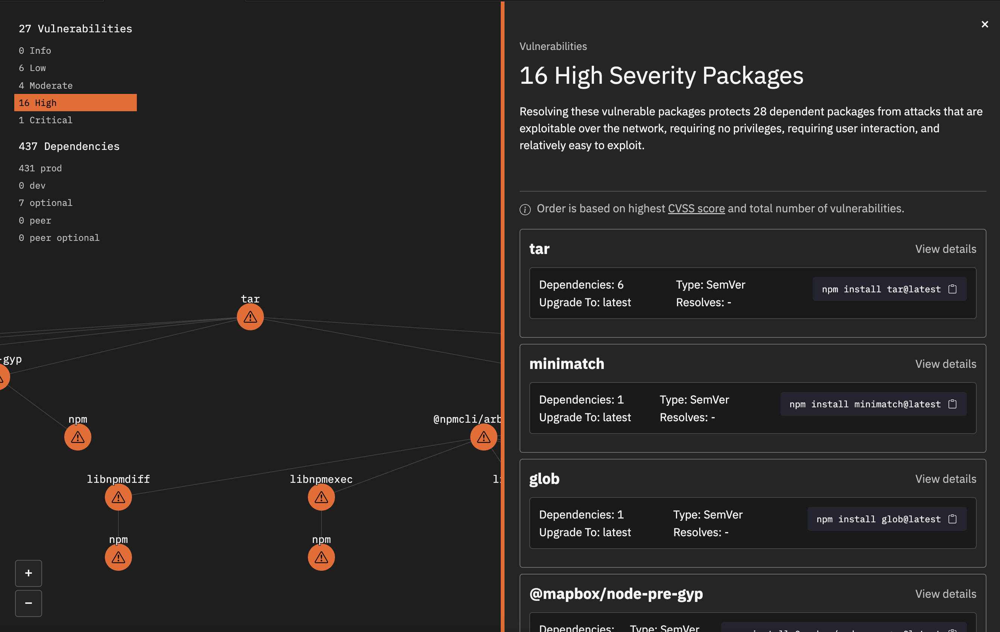
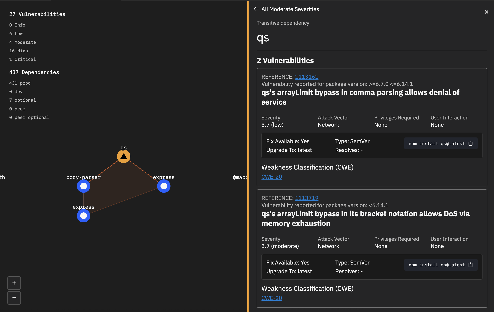
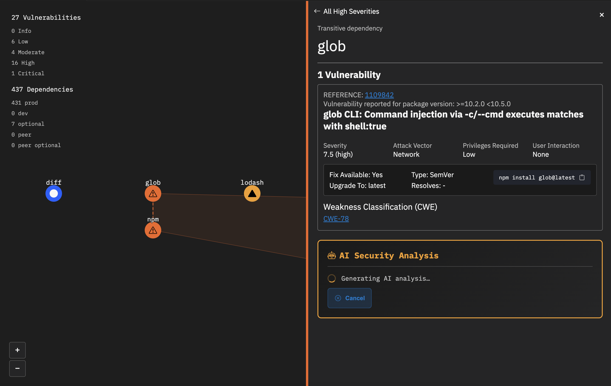

# Trident Vulnerability Package Scanner

Trident is a Node.js vulnerability package scanner that helps you automatically detect, fix, and block these vulnerabilities, keeping your software secure, reliable, and compliant.

## Features

- Map Vulnerabilities Before Attackers Do: Turn complex npm vulnerabilities into an interactive map—spot risks, trace their spread through dependencies, and know what to fix first.
- AI-Powered Insights: Plug in your own AI API key to get deep vulnerability analysis, CWE & GitHub advisory impacts, and a secure coding assistant that highlights actionable code diffs.

## Setup

1. Install the extension
2. Expand 'Vulnerable Packages' view 
3. Run "Run Scanner"
3. Start resolving vulnerabilities!

## Where to Start

1. When your canvas generates select the severities in the top left corner to display the severity inspector panel
2. Take a look at the panel, starting with the first package
3. Within the remediation block for each package, copy the command to your clipboard and paste into the terminal to resolve the package vulnerability
4. Within the package list you can click 'View details' for a package to read more information on the vulnerabilities of that package
5. If you entered your API key via the 'Trident | Add AI Insights' command, when you view package details you receieve AI-Powered Insights to help you better understand the vulnerabilities of that package

## Commands

| Command | Description |
|--------|-------------|
| Vulnerability Package Scanner | Generates your visual! |
| Trident Add AI Insights | Add your API Key |

## Screenshots

## Privacy

Your API key is stored securely using VS Code Secret Storage.

