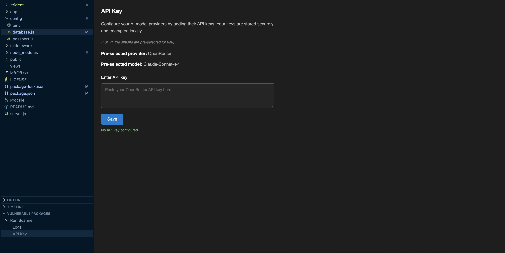

# Trident Vulnerability Package Scanner

Trident is a Node.js vulnerability package scanner that helps you automatically detect, fix, and block these vulnerabilities, keeping your software secure, reliable, and compliant.

## Features

- Map Vulnerabilities Before Attackers Do: Turn complex npm vulnerabilities into an interactive map—spot risks, trace their spread through dependencies, and know what to fix first.
- AI-Powered Insights: Plug in your own AI API key to get deep vulnerability analysis, CWE & GitHub advisory impacts, and a secure coding assistant that highlights actionable code diffs.

## Setup

1. Install the extension
2. Expand 'Vulnerable Packages' view 
3. Run "Run Scanner"
3. Start resolving vulnerabilities!

## Where to Start

1. When your canvas generates select the severities in the top left corner to display the severity inspector panel
2. Take a look at the panel, specifically the package at the top
3. Here, as well as with other packages, you can review the remediation details to resolve the package, or click 'View details' to read more information on the vulnerabilities of that package
4. Within the remediation block, copy the install to your clipboard and paste into the terminal to resolve the package vulnerability
5. If you click into a package at the bottom, if you entered your AI API key, you can view AI-Powered Insights to help you better understand the vulnerabilities of that package

## Commands

| Command | Description |
|--------|-------------|
| Vulnerability Package Scanner | Generates your visual! |

## Screenshots

## Privacy

Your API key is stored securely using VS Code Secret Storage.